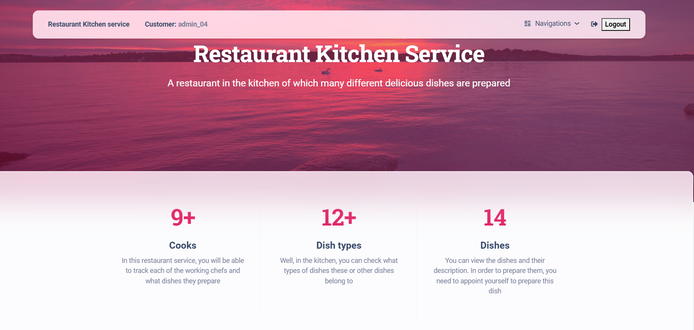

# Project Name

"Restaurant-kitchen-service" 

## Description

Django project about a restaurant kitchen in which the cooks manage what dishes they prepare and what types they are.

## Check it out!

[Restaurant Kitchen Service project deployed to Render](https://restaurant-kitchen-service-vnjc.onrender.com/)

## Installation

Python3 must be already installed

```shell
git clone https://github.com/MrsLFG/restaurant-kitchen-service
cd restaurant-kitchen-service
python3 -m venv venv
venv\Scripts\activate 
# for MacOS
source venv/bin/activate
pip install -r requirements.txt
python manage.py runserver #start Django Server
```

## Features

* Authentication functionality for Cook/User
* Managing cooks dishes and dish-types directly from website interface
* Powerful admin panel for advanced managing

## Demo

